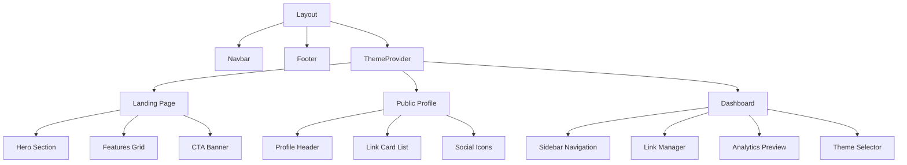

# LinkForge — Visual Sitemap

## Page Architecture

| Page | Route | Purpose | Key Components |
| :--- | :--- | :--- | :--- |
| Landing | `/` | Marketing page, hero, CTA | Hero, Features Grid, Footer |
| Public Profile | `/[username]` | User's link-in-bio page | Profile Header, Link Cards, Social Icons |
| Dashboard | `/dashboard` | Link management hub | Sidebar, Link List, Add/Edit Modal, Analytics Preview |
| Theme Editor | `/dashboard/themes` | Theme customization | Theme Cards, Preview Pane, Color Picker |
| Analytics | `/dashboard/analytics` | Click tracking stats | Charts, Stats Cards, Link Performance Table |

---

## Component Hierarchy

---

## User Flows

### 1. First-Time Visitor
`Landing Page` → `View Demo Profile` → `Sign Up CTA`

### 2. Link Management
`Dashboard` → `Add Link Modal` → `Set Title/URL` → `Reorder Links` → `Save`

### 3. Theme Selection
`Dashboard` → `Themes Tab` → `Select Theme` → `Preview` → `Apply`

### 4. View Analytics
`Dashboard` → `Analytics Tab` → `View Click Stats`

---

## Design Notes

- **Mobile-First**: All pages designed for 375px viewport first
- **Grand Animation**: Hero section features a signature "link chain forging" animation
- **Light/Dark Toggle**: Available on all pages via navbar icon
