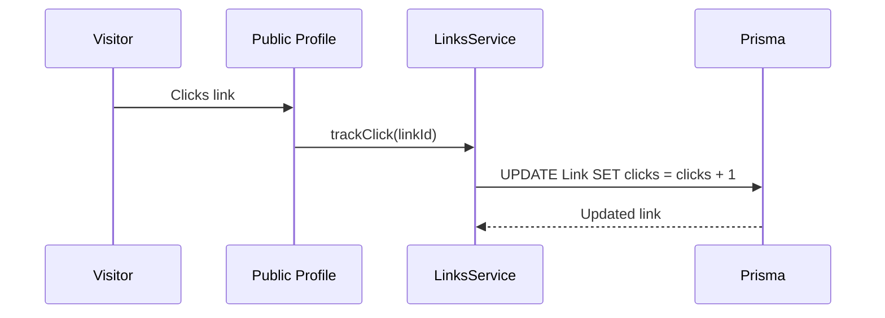

# Feature Blueprint: Analytics Dashboard (FR-004)

## 1. Goal
Provide users with insights into how their links are performing. Track click counts per link and display aggregate statistics in a dedicated analytics page.

## 2. User Flow
1. User navigates to **Dashboard → Analytics**
2. Sees **Total Clicks** across all links
3. Sees **Top Performer** (most-clicked link)
4. Sees **Click Breakdown** with visual progress bars ranked by clicks

## 3. Architecture

### Data Model
Clicks are stored directly on the `Link` model:
```prisma
model Link {
  id      String @id @default(cuid())
  clicks  Int    @default(0)  // ← Incremented on each click
  // ... other fields
}
```

### Key Files
| File | Purpose |
|------|---------|
| [page.tsx](file:///c:/CreativeOS/01_Projects/Code/Personal_Stuff/2025-12-12_LinkForge/src/app/(dashboard)/dashboard/analytics/page.tsx) | Analytics dashboard UI (Server Component) |
| [links.service.ts](file:///c:/CreativeOS/01_Projects/Code/Personal_Stuff/2025-12-12_LinkForge/src/features/links/services/links.service.ts) | `getLinks()` fetches click data, `trackClick()` increments |
| [/[username]/page.tsx](file:///c:/CreativeOS/01_Projects/Code/Personal_Stuff/2025-12-12_LinkForge/src/app/[username]/page.tsx) | Public profile triggers click tracking |

### Click Tracking Flow


## 4. Computed Stats
Stats are calculated in the page component:
```typescript
const totalClicks = links.reduce((acc, link) => acc + link.clicks, 0);
const maxClicks = Math.max(...links.map((l) => l.clicks), 1);
const sortedLinks = [...links].sort((a, b) => b.clicks - a.clicks);
```

## 5. Verification
- Click a link on public profile → refresh analytics → count should increase
- Links with more clicks appear higher in breakdown
- Progress bars scale relative to the max clicks
